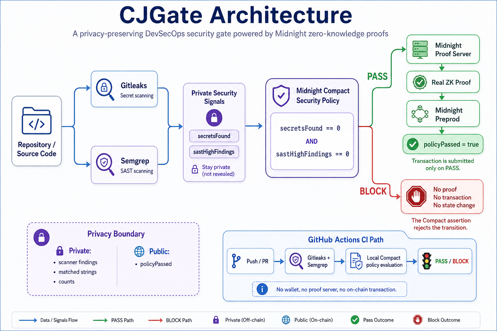

# CJGate

**Privacy-preserving DevSecOps security gates powered by Midnight zero-knowledge proofs.**

CJGate scans a software repository with real security tools while keeping the underlying security findings private. A Midnight Compact contract verifies that the repository satisfies the required security policy, allowing the project to prove compliance without revealing the scanner findings or their counts.

## Architecture



CJGate runs Gitleaks and Semgrep locally and converts their results into private security signals. Midnight Compact evaluates those signals as private witnesses.

A clean repository can generate a real zero-knowledge proof and submit a transaction to Midnight Preprod, while a policy violation is rejected before proof generation or transaction submission.

## Why CJGate?

Traditional CI/CD security pipelines often expose detailed scanner results to logs, dashboards, or third-party systems.

Those findings may reveal sensitive information such as:

- exposed credential locations
- vulnerable source code
- internal implementation details
- security posture information

CJGate separates **security evidence** from **security verification**.

The findings remain private, while Midnight is used to prove that the security policy was satisfied.

## Security policy

CJGate currently integrates two real DevSecOps scanners:

- **Gitleaks** for secret detection
- **Semgrep** for static application security testing

Their results are normalized into two private signals:

```text
secretsFound
sastHighFindings
```

The Compact contract enforces:

```text
secretsFound == 0
AND
sastHighFindings == 0
```

These values are supplied as private witnesses and are never written to the public ledger.

Only the public policy state is exposed:

```text
policyPassed = true
```

If either private value violates the policy, the Compact assertion fails before a valid state transition is produced.

## Two execution paths

CJGate provides two separate execution paths.

### 1. CI security gate

```bash
npm run cjgate:check
```

The GitHub Actions workflow runs on pushes to `main` and pull requests targeting `main`.

It performs:

```text
Gitleaks
    +
Semgrep
    ↓
Private security signals
    ↓
Compact policy evaluation
    ↓
PASS / BLOCK
```

The CI path evaluates the Compact policy locally and does not require a wallet, Midnight node, proof server, or Preprod credentials.

A clean repository produces a successful GitHub Actions run.

A repository that violates the security policy causes the real repository scan to return a non-zero exit code and the GitHub Actions job fails.

### 2. Live Midnight ZK proof

```bash
npm run cjgate:live -- --source fixtures/clean
```

The live path connects the real scanner results to the deployed CJGate contract and uses the Midnight Proof Server to generate a real zero-knowledge proof.

For a clean repository:

```text
Gitleaks + Semgrep
        ↓
private witnesses
        ↓
Compact contract
        ↓
Midnight Proof Server
        ↓
real ZK proof
        ↓
Midnight transaction
        ↓
policyPassed = true
```

For a policy violation:

```text
security violation
        ↓
Compact assertion fails
        ↓
no proof
no transaction
no state change
```

## Midnight Preprod deployment

CJGate has been deployed and verified on Midnight Preprod.

### Contract address

```text
c0fb1764ead1c0aa4196f1dfa6ae6657b6d4cb4a8fcab60fff94dbb317875066
```

### Initial verified PASS transaction

This transaction changed the public policy state from `false` to `true`.

```text
00011d8c27cb17b22ed12f129ac275f7becea0f3d7fe629c83111e6ca9e2ca2343
```

Block height:

```text
2308502
```

During that successful Preprod execution:

```text
policyPassed: false → true
proofProvider.proveTx calls: 1
walletProvider.submitTx calls: 1
POST /prove requests: 2
POST /check requests: 1
```

### Latest live demo transaction

CJGate was also re-executed against the same deployed Preprod contract to verify that the live proof path continues to generate a real proof and transaction.

```text
00feddc7c027be9b4deae4615a10cbf196e77fa7520e1b7caee057a4175c13c7ee
```

Block height:

```text
2327106
```

During this invocation:

```text
policyPassed (before): true
policyPassed (after):  true

proofProvider.proveTx calls: 1
walletProvider.submitTx calls: 1
POST /prove requests: 2
POST /check requests: 1
proof ok log lines: 2
```

The state was already `true` from the earlier successful proof, but this invocation generated a new real zero-knowledge proof and submitted a new Midnight Preprod transaction.

### Verified BLOCK behavior

For both the synthetic secret violation and SAST violation:

```text
proveTx calls: 0
submitTx calls: 0
POST /prove requests: 0
POST /check requests: 0
policyPassed remained unchanged
```

The result is:

```text
BLOCK — Compact assertion rejected the state transition
no proof requested, no transaction submitted
```

This confirms that policy violations are rejected before proof generation or transaction submission.

## Privacy model

CJGate does not expose:

- secret contents
- Gitleaks findings
- Semgrep findings
- vulnerable source snippets
- matched strings
- scanner finding counts
- `secretsFound`
- `sastHighFindings`
- wallet mnemonics
- wallet private keys

The public blockchain only needs to observe the resulting policy state.

## Local verification

Compile the Compact contract:

```bash
npm run compile
```

Validate TypeScript:

```bash
npm run build
```

Test the Compact policy without a network:

```bash
npm run verify
```

Expected behavior:

| Test | Result |
|---|---|
| Clean input | PASS |
| Secret violation | BLOCK |
| SAST violation | BLOCK |

## Real scanner tests

Clean fixture:

```bash
npm run cjgate:check -- --source fixtures/clean
```

Expected:

```text
Gitleaks scan completed
Semgrep scan completed

Security policy passed
```

Secret violation:

```bash
npm run cjgate:check -- --source fixtures/secret
```

Expected:

```text
Security policy blocked
```

SAST violation:

```bash
npm run cjgate:check -- --source fixtures/sast
```

Expected:

```text
Security policy blocked
```

## Local Midnight proof flow

Start the Midnight services:

```bash
npm run setup
```

Run a clean live proof:

```bash
npm run cjgate:live -- --source fixtures/clean
```

Test blocked flows:

```bash
npm run cjgate:live -- --source fixtures/secret
npm run cjgate:live -- --source fixtures/sast
```

## Preprod commands

Initialize and synchronize the dedicated CJGate Preprod wallet:

```bash
npm run cjgate:preprod:init
```

Show only its public address:

```bash
npm run cjgate:preprod:address
```

Deploy the CJGate contract:

```bash
npm run cjgate:preprod:deploy
```

Run a real Preprod proof:

```bash
npm run cjgate:preprod:live -- --source fixtures/clean
```

Verify blocked cases:

```bash
npm run cjgate:preprod:live -- --source fixtures/secret
npm run cjgate:preprod:live -- --source fixtures/sast
```

Wallet synchronization state and deployment state are stored locally in gitignored files.

## GitHub Actions

Workflow:

```text
.github/workflows/cjgate-security-gate.yml
```

The workflow runs:

1. Node.js 22 setup
2. `npm ci`
3. Gitleaks 8.30.1
4. Semgrep 1.174.0
5. Compact compiler 0.31.1
6. Compact compilation
7. TypeScript validation
8. Clean fixture validation
9. Secret BLOCK validation
10. SAST BLOCK validation
11. Real repository security scan

The repository scan returns a failing GitHub Actions job when CJGate blocks the repository.

## Tech stack

- Midnight
- Compact
- Zero-Knowledge Proofs
- TypeScript
- Node.js
- Gitleaks
- Semgrep
- GitHub Actions
- Docker
- DevSecOps
- CI/CD

## Project structure

```text
cjgate/
├── .github/
│   └── workflows/
│       └── cjgate-security-gate.yml
│
├── docs/
│   └── cjgate-architecture.png
│
├── contracts/
│   └── cjgate.compact
│
├── fixtures/
│   ├── clean/
│   ├── secret/
│   └── sast/
│
├── scripts/
│   ├── cjgate-check.ts
│   ├── cjgate-live.ts
│   ├── cjgate-preprod.ts
│   └── policy-check.ts
│
├── src/
│   ├── scanners/
│   │   ├── gitleaks.ts
│   │   └── semgrep.ts
│   ├── live/
│   ├── dust-registration.ts
│   ├── policy.ts
│   ├── witnesses.ts
│   ├── deploy.ts
│   ├── network.ts
│   └── wallet.ts
│
├── docker-compose.yml
├── package.json
└── README.md
```

## What CJGate demonstrates

CJGate demonstrates that DevSecOps security verification does not require publishing the underlying security findings.

By combining real security scanners with Midnight private witnesses and zero-knowledge proofs, a repository can prove that it satisfies a security policy while keeping sensitive security evidence private.
